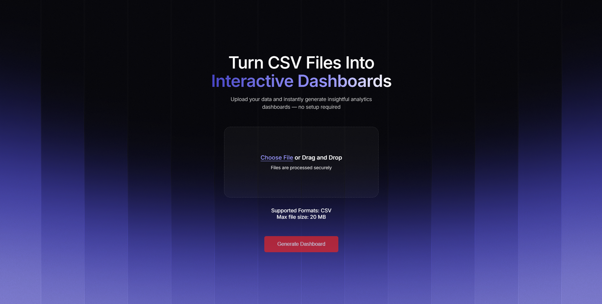
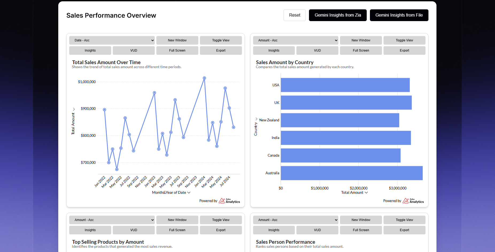
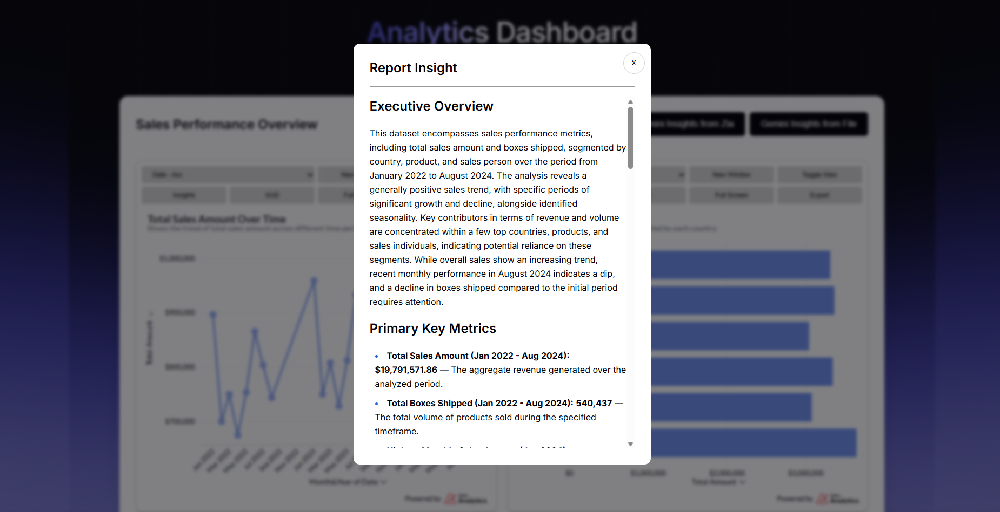

# AI Dashboard Generator

Turn any CSV file into interactive dashboards with AI-powered insights.

AI Dashboard Generator is a web application that accepts a CSV file, automatically generates analytics dashboards, and produces intelligent report insights using AI.

## Overview

The system works in the following flow:

1. User uploads a **CSV file**
2. Backend processes the file and:
   - Uploads data
   - Extracts column metadata
   - Sends column details to Gemini for chart configuration
   - Generates reports based on AI-generated configs
   - Fetches embed URLs for reports
   - Retrieves Insights
3. Frontend renders interactive dashboards using embed URLs

## Technologies Used

- Frontend: HTML, CSS, & JS
- Backend: API-based data processing
- AI Model: Gemini (gemini-2.5-flash-lite)
- Analytics Engine: Zia Insights
- Embedded Dashboards via Zoho Analytics

---

## Project Structure (Optional)

```bash
.
├── frontend/
├── backend/
├── images/
├── .gitignore
└── README.md
```

## Preview

### File Upload Interface



---

### Dashboard



---

### AI Generated Report Insight



---
